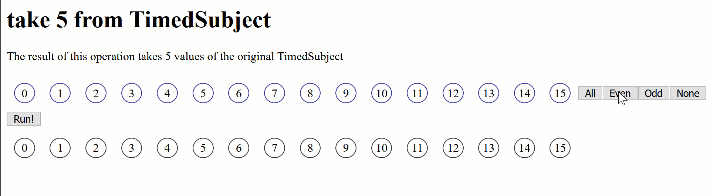
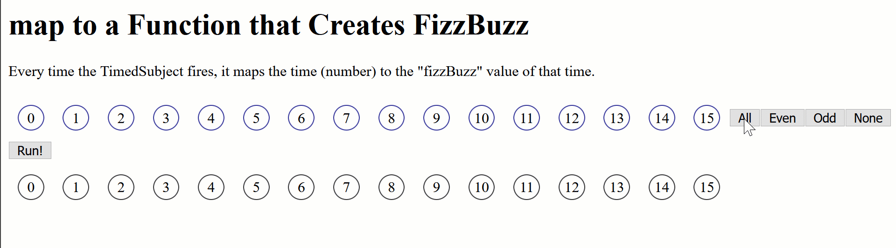
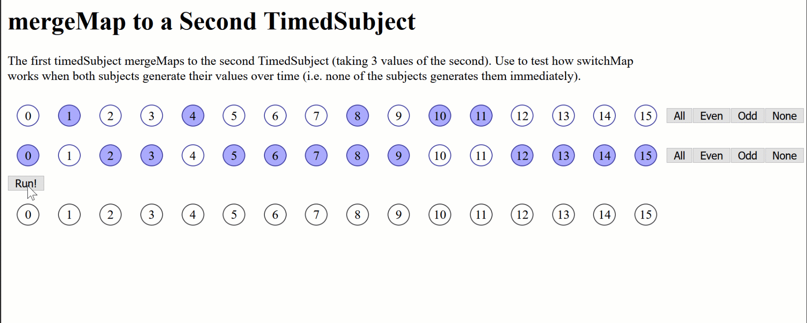
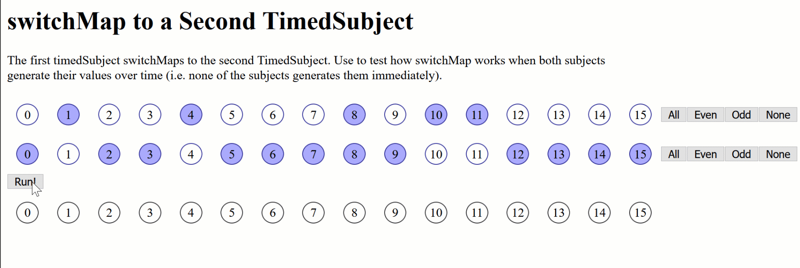
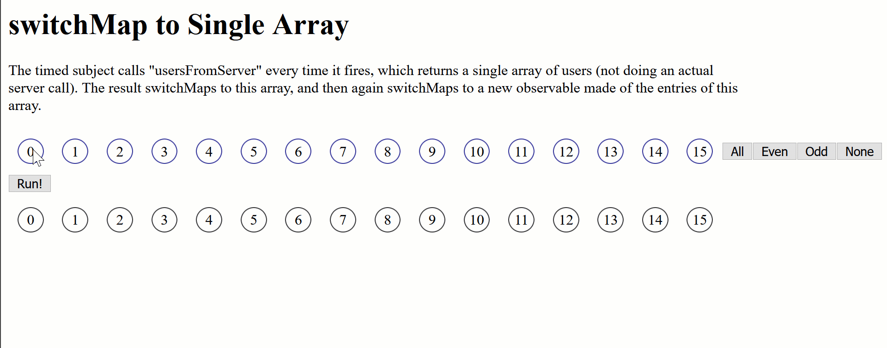
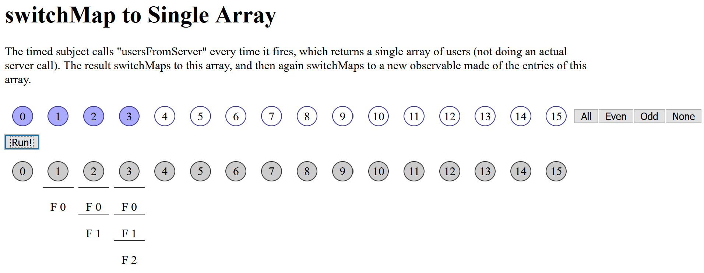

# rxjs-explorer - Experience how RxJS Operators Work over Time

_rxjs-explorer_ allows you to create a combination of observables
and operators and shows you which values appear in the results
**at certain points in time** when the subjects produce their values over time.



## Why rxjs-explorer?

A team at one of my coaching-clients&mdash;I coach teams doing frontend-work, mostly Angular there&mdash;wanted to discuss RxJS
operators. "What exactly are the differences between `concatMap`,
`mergeMap` and `switchMap`? And how do we decide which to use?"

My problem was... I find those differences hard to remember too. For simple situations, it's not that hard:



But, how exactly will an observable that `mergeMap`s to another observable behave if both fire their values over time? And how exactly does that differ from `switchMap`?

So, I created this little tool, and we found it very useful for discussing the differences.

## Usage

Using this tool requires you to edit some code, but it's a tool aimed at software developers anyway.

Suppose you want to compare how `mergeMap` and `concatMap` work. Go to [src/app/app.component.ts](./src/app/app.component.ts) and edit `ngOnInit` to use `mergeMapToSecondTest` as `this.test`:

```typescript
ngOnInit(): void {
    const takeTest = createTakeTest();
    const mapToFizzBuzzTest = createMapToFizzBuzzTest();
    const concatMapToSecondTest = createConcatMapToSecondTest();
    const mergeMapToSecondTest = createMergeMapToSecondTest();
    const switchMapToSecondTest = createSwitchMapToSecondTest();
    const switchMapToThirdTest = createSwitchMapToThirdTest();
    const switchMapToSingleTest = createSwitchMapToSingleTest();

    this.test = mergeMapToSecondTest;
}
```

Run the application and it will show the test for `mergeMap`:



Now edit the file again to use the test for `switchMap`:



Have a look at the test definitions. The most basic one is for `take(5)`, the first example from this readme. It's in [src/app/observable-tests/take.ts](./src/app/observable-tests/take.ts):

```typescript
export function createTakeTest(): ObservableTest {
    const s1 = new TimedSubject<number>(i => i);
    const result = (([s]) => s.subject.pipe(
        take(5)
    ));

    return {
        headline: 'take 5 from TimedSubject',
        description: `The result of this operation takes 5 values of the original TimedSubject`,
        subjects: [ s1 ],
        result,
    }
}
```

To experiment with observables and operators, edit the existing tests or create your own tests based on the ones that are already there.

## How to interpret the results

Here's a test that simulates multiple server calls and their results([src/app/observable-tests/switchMapToSingle.ts](./src/app/observable-tests/switchMapToSingle.ts)):

```typescript
interface Result {
	id: number,
	firstName: string,
	lastName: string,
}
export function createSwitchMapToSingleTest(): ObservableTest {
	const first = new TimedSubject<Observable<Result[]>>(i => usersFromServer(i));
	const result = (([s1]: RunnableTimedSubject<Observable<Result[]>>[]) => s1.subject.pipe(
		switchMap(x => x),
		switchMap(x => of(...x)),
		map(x => x.firstName)
	));

	return {
		headline: 'switchMap to Single Array',
		description: `The timed subject calls "usersFromServer" every time it fires, 
			which returns a single array of users (not doing an actual server call).
			The result switchMaps to this array, and then again switchMaps to a new
			observable made of the entries of this array.`,
		subjects: [ first ],
		result,
	}
}

function usersFromServer(time: number): Observable<Result[]> {
	const keys = Array.from(Array(time).keys());
	return of(keys.map(i => { return { id: i, firstName: `F ${i}`, lastName: `L ${i}` }}));
}
```



`usersFromServer` returns an observable with a single result. This result is an array of `Result` ojects, each having an `id`, a `firstName` and a `lastName`. Even though there is no real server call here, this is a result you might get from a server: An array of json objects, converted to TypeScript objects.

```typescript
const first = new TimedSubject<Observable<Result[]>>(i => usersFromServer(i));
```

creates a `TimedSubject` that, at every point in time where it should generate a value (as selected in the UI), calls `usersFromServer`. So, at time 0 the contained observable is an array with 0 users, at time 1 it contains 1 user, at time 2 it contains 2 and at time 3 it contains 3 users.

The result is created by `switchMap`ing to the content of the observable. Now, at every point in time, we have an array of users or nothing. Then we `switchMap` again to an observable with all the entries from the array (`x => of(...x)`). And then we map to the first name.



The resulting observable, after processing all 15 points in time, has **"fired" 6 times**:

* Once at time 1, producing the value "F 0"
* Twice at time 2, producing the values "F 0" and "F 1"
* Three times at time 3, producing the values "F 0", "F 1" and "F 2"

So, when under a point in time there are multiple values separated by horizontal lines, then **all** of those values were produced by the observable at that point in time.

## About the Author

David Tanzer is an independent coach, consultant and trainer. He helps software teams to develop better software and to get better at developing software.

* Follow [@dtanzer](https://twitter.com/dtanzer) on Twitter to stay in touch
* Check out [our services](https://www.devteams.at/services/) if you are interested in coaching, consulting or training.

## License: MIT

Copyright (c) 2021 David Tanzer (business@davidtanzer.net)

Permission is hereby granted, free of charge, to any person obtaining a copy
of this software and associated documentation files (the "Software"), to deal
in the Software without restriction, including without limitation the rights
to use, copy, modify, merge, publish, distribute, sublicense, and/or sell
copies of the Software, and to permit persons to whom the Software is
furnished to do so, subject to the following conditions:

The above copyright notice and this permission notice shall be included in all
copies or substantial portions of the Software.

THE SOFTWARE IS PROVIDED "AS IS", WITHOUT WARRANTY OF ANY KIND, EXPRESS OR
IMPLIED, INCLUDING BUT NOT LIMITED TO THE WARRANTIES OF MERCHANTABILITY,
FITNESS FOR A PARTICULAR PURPOSE AND NONINFRINGEMENT. IN NO EVENT SHALL THE
AUTHORS OR COPYRIGHT HOLDERS BE LIABLE FOR ANY CLAIM, DAMAGES OR OTHER
LIABILITY, WHETHER IN AN ACTION OF CONTRACT, TORT OR OTHERWISE, ARISING FROM,
OUT OF OR IN CONNECTION WITH THE SOFTWARE OR THE USE OR OTHER DEALINGS IN THE
SOFTWARE.
